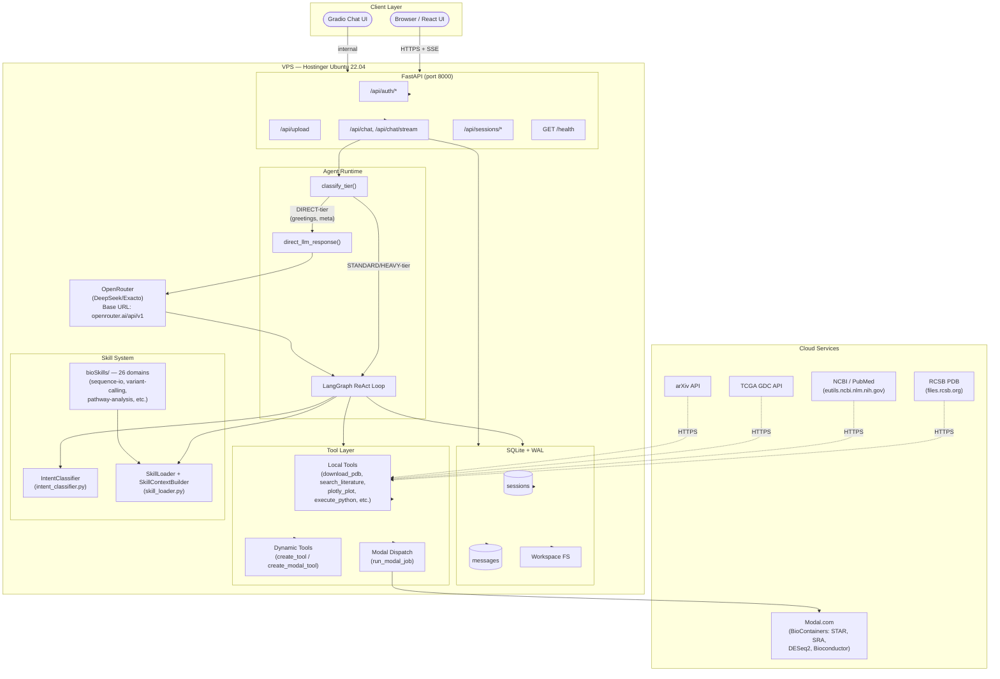
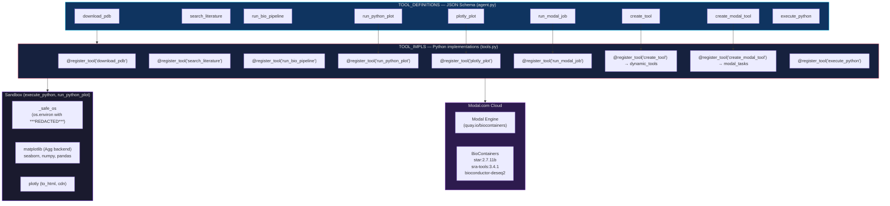
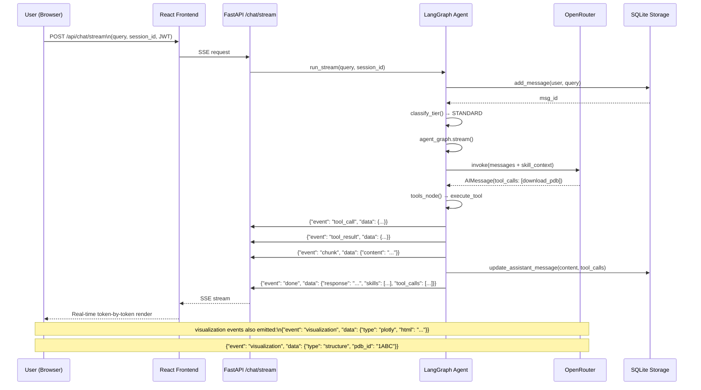
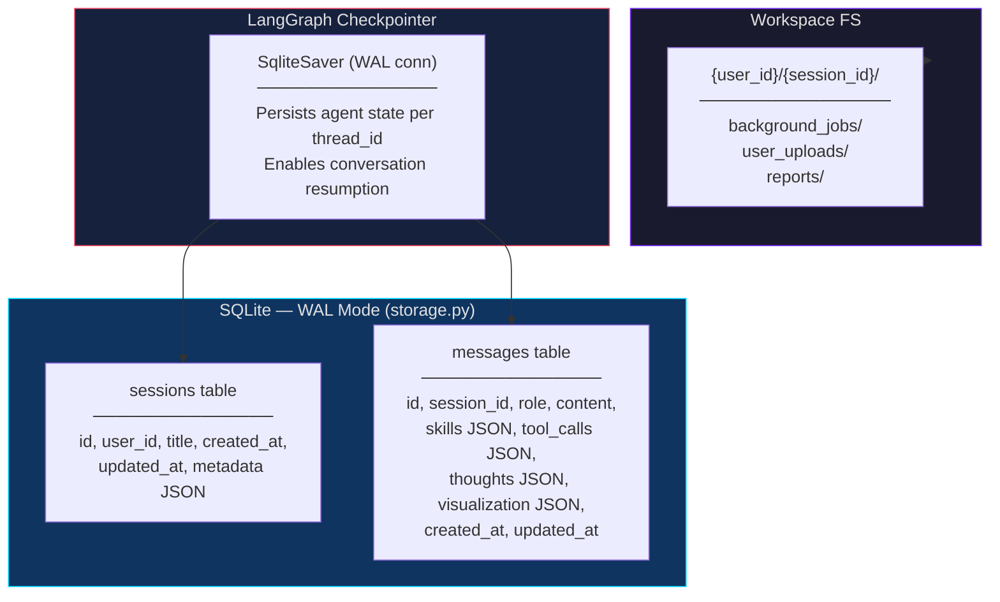
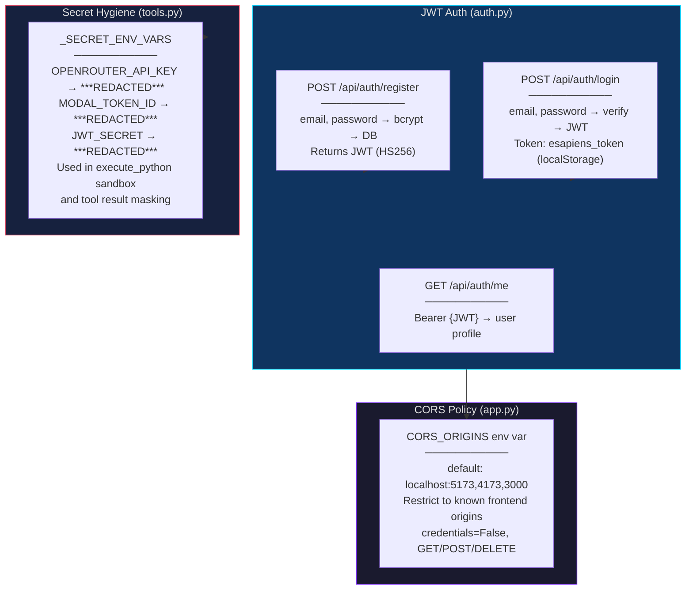

# E.sapiens Architecture — Mermaid Flow Diagrams

> **How to view:** Paste any code block below into [mermaid.live](https://mermaid.live) or any Markdown previewer with Mermaid support.

---

## 1. Full System Overview



---

## 2. LangGraph ReAct Agent Loop (Zoomed)

```mermaid
flowchart LR
    subgraph AgentGraph["LangGraph StateGraph — agent_graph"]
        direction TB
        START([User Query]) --> ClassifyIntent
        
        ClassifyIntent["classify_intent_node()\n───────────────\n• intent_classifier.classify_query()\n• SkillLoader.load_skills()\n• Build SystemMessage with\n  skill_context injection\n• Return {messages, loaded_skills}"]

        ClassifyIntent --> CallModel
        
        CallModel["call_model()\n───────────────\n• Check placeholder key → _mock_llm_response\n• llm.bind_tools(TOOL_DEFINITIONS)\n• llm.invoke(messages)\n• Retry without tools on 400 error\n• Return {messages: [AIMessage]}"]

        CallModel --> ShouldContinue{"tool_calls\npresent?"}

        ShouldContinue -->|Yes| ExecuteTools
        ShouldContinue -->|No| Finalize

        ExecuteTools["tools_node()\n───────────────\n• Extract AIMessage.tool_calls\n• For each: execute_tool(name, args)\n• Returns ToolMessage[]\n• Records to tool_calls log"]
        
        ExecuteTools --> CallModel

        Finalize["finalize_node()\n───────────────\n• Extract last AIMessage.content\n• Return {result: str}"]
        
        Finalize --> END([Response to User])
    end

    style AgentGraph fill:#1a1a2e,stroke:#00d4ff,color:#e0e0e0
    style ClassifyIntent fill:#16213e,stroke:#e94560
    style CallModel fill:#16213e,stroke:#e94560
    style ExecuteTools fill:#16213e,stroke:#e94560
    style Finalize fill:#16213e,stroke:#e94560
```



---

## 3. Tiered Query Routing

```mermaid
flowchart TD
    Q([User Query]) --> T1{regex _DIRECT_PATTERNS\n(greeting, meta, simple def)?}
    T1 -->|Match| DIRECT["QueryTier.DIRECT\n────────────\nRun: direct_llm_response()\nModel: OPENROUTER_DIRECT_MODEL\nTemp: 0.3 | Max: 1024\nNo tools, no skill context\nFast path (< 200ms)"]
    DIRECT --> OUT([Response])

    T1 -->|No match| T2{Short def\n< 12 words\n+ no skills matched?}
    T2 -->|Yes| DIRECT

    T2 -->|No| T3{regex _HEAVY_PATTERNS\n(pipeline, compare, integrate,\nmulti-step, analyze+plot)?}
    T3 -->|Yes| HEAVY["QueryTier.HEAVY\n────────────\nRun: full ReAct loop\nSkill context: max 6000 chars\nMay iterate 3+ rounds\nModal dispatch for bio pipelines"]
    HEAVY --> OUT

    T3 -->|No| T4{skill_paths >= 3?}
    T4 -->|Yes| HEAVY
    T4 -->|No| STANDARD["QueryTier.STANDARD\n────────────\nRun: full ReAct loop\nSkill context: matched domains\n1-3 tool call iterations\nStandard LLM config"]
    STANDARD --> OUT

    style DIRECT fill:#0f3460,stroke:#00d4ff,color:#fff
    style HEAVY fill:#e94560,stroke:#fff,color:#fff
    style STANDARD fill:#1a1a2e,stroke:#e94560,color:#fff
```

---

## 4. Tool Architecture



---

## 5. Frontend — React + SSE Streaming



---

## 6. bioSkills — 26 Domain Skill Contexts

```mermaid
flowchart TB
    subgraph SkillTree["bioSkills/ Directory — 26 Skill Domains"]
        direction TB
        SB["structural-biology/\nstructure-io | geometric-analysis | alphafold-predictions"]
        SEQ["sequence/\nsequence-io | sequence-manipulation | alignment"]
        VAR["variant-calling/\nvcf-basics | variant-annotation | clinical-interpretation"]
        EXP["expression & transcriptomics/\nrna-quantification | differential-expression"]
        GEN["genome/\nread-alignment | read-qc | methylation-analysis"]
        FUN["functional genomics/\nchip-seq | atac-seq"]
        COMP["comparative & population/\nphylogenetics | population-genetics"]
        MICRO["microbiome/\nmetagenomics | microbiome"]
        PROT["proteomics"]
        PATH["pathway-analysis | database-access\n(database-access/interaction-databases)"]
        SC["single-cell"]
        CRISPR["crispr-screens"]
        ML["machine-learning"]
        CLIN["clinical-biostatistics"]
        DATAVIZ["data-visualization"]
        PRIMER["primer-design"]
        CHEMO["chemoinformatics"]
    end

    subgraph SkillLoad["Skill Loading Pipeline"]
        IC["classify_intent_node()\n→ intent_classifier.classify_query()"]
        SL["SkillLoader.load_skills(skill_paths)\n→ read SKILL.md from disk (cached)"]
        SCB["SkillContextBuilder.build_context()\n→ max 6000 chars, truncate if needed"]
        INJ["Inject as {skill_context} into\nstandard system prompt"]
    end

    IC --> SL
    SL --> SCB
    SCB --> INJ

    SkillTree --> SL

    style SkillTree fill:#0f3460,stroke:#00d4ff,color:#e0e0e0
    style SkillLoad fill:#16213e,stroke:#e94560,color:#e0e0e0
```



---

## 7. Session Persistence & State



---

## 8. Authentication & Security



---

## Legend

| Color | Layer |
|-------|-------|
| `#0f3460` | VPS / Backend services |
| `#16213e` | Core agent logic (LangGraph nodes) |
| `#e94560` | Tool system / Dynamic components |
| `#7b2ff7` | Workspace / Persistence layer |
| `#2d1b4e` | Cloud / External services |
| `#1a1a2e` | UI / Client layer |